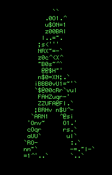

<head>
    <link rel="stylesheet" href="css/style.css">
</head>
<h1>Tim Daubner</h1>
I'm a game production professional based in Germany with a passion for interactive media, technology, and digital storytelling. With a background in game development and production, my focus is on turning creative ideas into engaging and well-structured interactive experiences. 
My work combines technical understanding with creative problem-solving, allowing me to coordinate projects, support development teams, and guide productions from concept to completion. Through my training in game development and media production, i have built strong skills in project organization, collaboration, and the creative process behind digital games. 
I'm particularly interested in the intersection of technology, design, and user experience, and enjoys exploring new tools and workflows that improve how interactive projects are built and delivered.
 
 
  